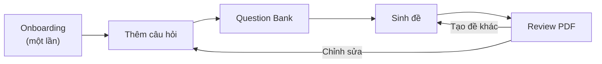

# vn-math-thpt-project

<p align="center">
  
  
  
</p>
<p align="center">
  
  
  
  
  
</p>

Sinh đề Toán THPT → **PDF XeLaTeX**. Thầy/cô làm việc trong **chat**; agent theo [AGENTS.md](AGENTS.md). Không cần gõ terminal.

**Bắt đầu:** [src/docs/onboarding.md](src/docs/onboarding.md) — chọn vai trò (giáo viên trường / gia sư / cả hai), loại đề, cây ngân hàng. `exam-types/` và `question-bank/` bắt đầu **trống**.

## Cách vận hành (làm đề)

Onboarding chỉ chạy lần đầu. Sau đó, thầy/cô cùng agent bổ sung ngân hàng, sinh đề và review PDF theo vòng lặp.



Chi tiết: [vòng đời làm đề](src/docs/chat-workflow.md) · [pipeline kỹ thuật](src/docs/how-it-works.md) · [các lớp template](src/docs/templates.md).

## Setup

[src/docs/setup/](src/docs/setup/README.md) — Windows / macOS / Linux. Hoặc bảo agent: “cài giúp TeX”.

```bash
python3 -m pip install -r requirements.txt
```

## Chat

Lần đầu: “Mình là giáo viên trường / gia sư, …” — agent chạy onboarding.  
Sau đó: “Ra đề …” — PDF trong `src/output/`.

## CLI (sau khi onboarding đã có loại đề)

```bash
python3 src/scripts/generate/generate_exam.py \
  --lop 12 \
  --loai-de <slug-da-tao> \
  --mode ca-hai \
  --output-name de-a
```

`--mode`: `de-thi` | `dap-an` | `ca-hai`

## Layout

```
src/docs/            hướng dẫn + onboarding
src/configs/         profile.yaml, school.yaml, exam-types/
src/question-bank/   câu hỏi JSONL
src/templates/       exam.cls, papers, items
src/scripts/         tools (see scripts/README.md — grow by need)
src/tests/           mirrors scripts when split
src/output/          PDF đã sinh
```
