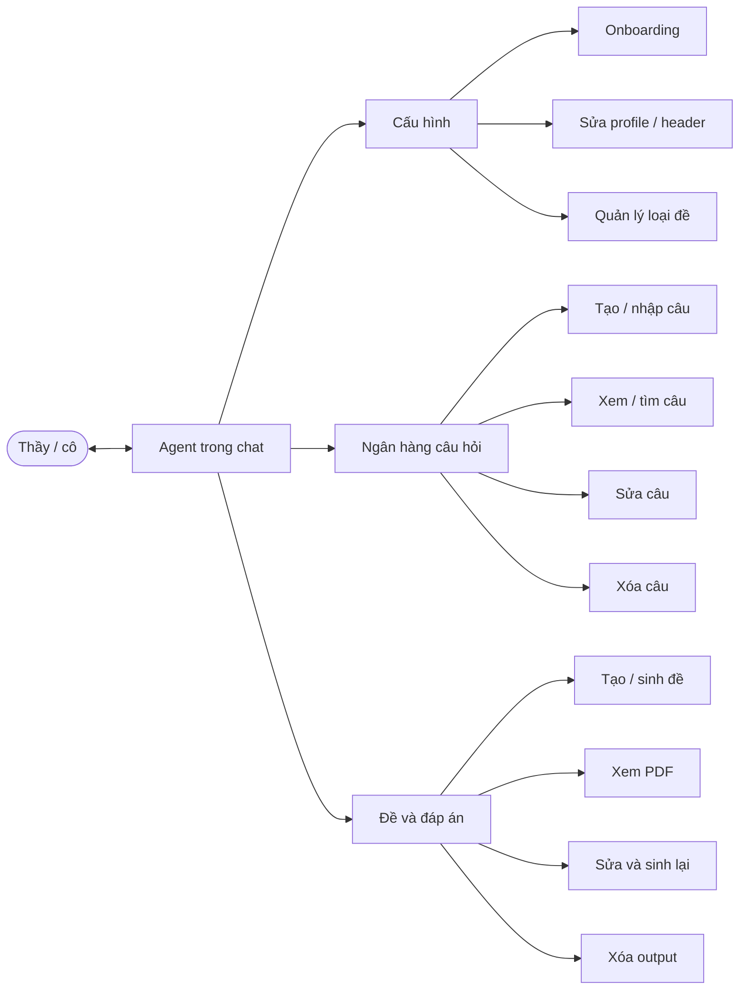

# Teacher chat workflow

The teacher types in chat (or pastes a photo). You run tools. They check the PDF.

## Use cases

Agent may write LaTeX directly for a question, including TikZ geometry, variation tables, tables, or `\includegraphics`. Save reusable work back to the question bank. Confirm with the teacher before deleting bank entries or replacing substantive authored content.

During PDF review, revise the source rather than only patching generated `.tex`:

- wrong question, answer, solution, diagram → question bank;
- wrong count, duration, ratio → exam-type config;
- wrong page or item layout → templates.

## First message in a new workspace

1. Load `AGENTS.md`.
2. If `xelatex` / `latexmk` / Python deps missing → skill `checking-setup`.
3. If `src/configs/profile.yaml` `completed` is not `true` → skill `onboarding-teacher` ([onboarding.md](onboarding.md)). Stop inventing loại đề until that finishes.

## Intake (generate a đề) — after onboarding

Ask only for what is still unknown:

| Ask | Why |
|-----|-----|
| Loại đề | Must match a YAML they already created, or create one now |
| Phạm vi (chương / buổi / học sinh) | Never guess |
| Số câu + mức độ (nếu họ dùng) | Override YAML |
| Đề / đáp án / cả hai | `--mode` |
| Tên đề (optional) | Output folder slug |

Then run `src/scripts/generate_exam.py`. Point them at the PDF.

## Intake (add questions)

Accept: typed stem, photo of SGK/đề, Word/PDF paste, messy notes.

Hint they can send: đề gốc, đáp án, lời giải, lớp/chuyên đề, mức độ (theo scheme họ đã chọn lúc onboarding).

Write JSONL under the **bank layout from onboarding**. Schema ideas: [question-bank.md](question-bank.md).
